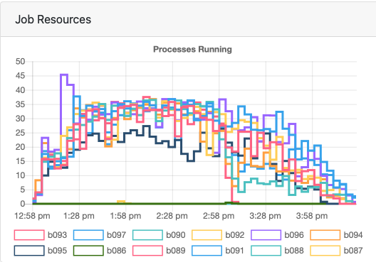
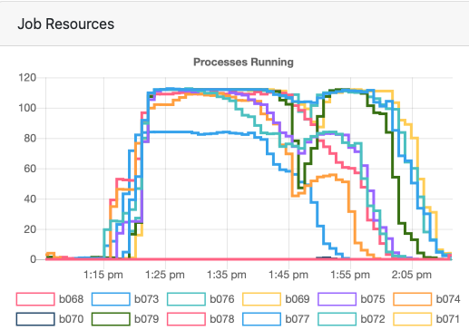

# Using Temple's OwlsNest
Temple has a High Performance Computing cluster and one specific aspect that is relevant to our lab is the [OwlsNest](https://www.hpc.temple.edu/owlsnest2/). It will help us process our neuroimaging data much more quickly than we can do on our local resources. This resource is especially useful for the data coming in off our RF1 grant since it uses mulit-echo fMRI and benefits from `mriqc`, `fmriprep`, `qsiprep`, and `tedana`. You can also run tons of `feat` jobs relatively easily

Eventually, we might be able to effectively use other resources tied to their GPU systems, but these systems only work for DWI analyses right now.

In all use cases, the biggest thing to keep in mind is efficient use of the resources (more on this below). In a nutshell, you need to have a good sense of how many CPUs and how much memory you need when you submit jobs (a.k.a. tasks) to an HPC. Don't request more resources than you need, but don't request too few.

1. [What should you know already before using the OwlsNest?](what-should-you-know)
2. [Summary of basic steps](summary-of-basic-steps)
3. [Examples and notes](example-and-notes)
  -[Copying files with rsync](rsync)
  -[Running FMRIprep](fmriprep)
  -[Running MRIQC](mriqc)
  -[Processing diffusion data](diffusion-data)
  -[Running statistics with FSL](statistics)
4. [Things to consider](things-to-consider)


## What should you know already before using the OwlsNest?
Before you start playing around on the OwlsNest, you should be quite comfortable with Linux and using the command line for any tasks. You should also read through the documentation for the OwlsNest and especially job submission. This page assumes you have read their documentation and have a basic sense of the available resources and how to submit jobs.

If you're not quite comfortable with Linux and the command line, here are a few recommendations to help get you up to speed:
1. FSL course materials. See [Introduction to Unix](https://open.win.ox.ac.uk/pages/fslcourse/website/online_materials.html)
2. ReproNim materials. See [Command line / shell](http://www.repronim.org/module-reproducible-basics/01-shell-basics/) module.
3. The first five tutorials from this [University of Surrey site](http://www.ee.surrey.ac.uk/Teaching/Unix/).

Beyond basic operations in Linux, you should also have a good sense of how much resources your jobs require. This point is worth the redundancy, and more guidance is below.

## Summary of basic steps
1. Use `rsync` data from the Smith Lab Linux to your work directory on the OwlsNest.
2. Install Anaconda and any packages you need.
3. Set up your GitHub profile and clone your scripts. You can also just clone or fork this repository, but I should make it read only.
4. Run your jobs (or "calculations" as the OwlsNest folks say)
5. Use `rsync` to copy your results and output back to our Linux Box.

## Examples and notes

For my initial testing, I used all the subjects currently in the bids directory (N = 36). Each subject would have a maximum of 8 runs of data (4 tasks, 2 runs each). Since we have 4 echoes, this load would be multiplied by 4 for the initial processing steps leading up to `feat`. This means that programs like  `fmriprep` would be working 32 functional images for each subject.

Note that all of the scripts below currently read the contents of your bids directory and run the script on everyone there. This strategy is not optimal and you need to adjust what for your on use cases and ensure you request the appropriate amount of resources. I used the "normal" queue for everything.

### Copying files with rsync
Here are some commands that helped me get data back and forth. Note that you'll be prompted for your password each time. You should check these commands to make sure you don't wind up with duplicated directories (e.g., bids/bids) or copying the files without the folder.
```
# copy BIDS files from our Linux Box to the OwlsNest
rsync -avh --no-compress --progress /ZPOOL/data/projects/rf1-data-hpc/bids tug87422@owlsnest.hpc.temple.edu:work/rf1-data-hpc/.

# copy EV files from our Linux Box to the OwlsNest
rsync -avh --no-compress --progress /ZPOOL/data/projects/rf1-data-hpc//derivatives/fsl/EVfiles tug87422@owlsnest.hpc.temple.edu:work/rf1-data-hpc/derivatives/fsl/.

# copy fmriprep derivatives from the OwlsNest to our Linux box
rsync -avh --no-compress --progress tug87422@owlsnest.hpc.temple.edu:work/rf1-data-hpc/derivatives/fmriprep /ZPOOL/data/projects/rf1-data-hpc/derivatives/.
```

### Running FMRIprep
The [fmriprep-hpc.sh](code/fmriprep-hpc.sh) script currently reads the contents of your bids directory and runs `fmriprep` on everyone there. For this job, my resource request was `nodes=12:ppn=4`. I did not want to use all of the processors on the node because I didn't want to run into memory limits. This job took about 3.5 hours to complete, but I think I had to re-run because some participants crashed with memory issues, though this may have been a different test. Either way, it's important to remember that `fmriprep` can pick up where it left off and use whatever partial output it has in scratch. So, don't delete your scratch till you know it's all good.

The utilization was only 42% across the whole job, which suggests I should've requested less or should've tweaked my `fmriprep` settings. But this isn't super straightforward since the processes are not using the same resources throughout the whole duration of the job, as you can see in the image below.




### Running MRIQC
The [mriqc-hpc.sh](code/mriqc-hpc.sh) script currently reads the contents of your bids directory and runs `mriqc` on everyone there. For this job, my resource request was `nodes=12:ppn=4`. I did not want to use all of the processors on the node because I didn't want to run into memory limits. This job took about 1 hour to complete, and I don't think there were any issues with the output.

The utilization was only 45% across the whole job, which suggests I should've requested less. But this isn't super straightforward since the processes are not using the same resources throughout the whole duration of the job, as you can see in the image below.




### Running TEDANA
TEDANA helps us denoise our multiecho data, but it can be rather intensive to run since it has to work with all of the echoes. The [tedana-hpc.sh](code/tedana-hpc.sh) script currently reads the contents of your bids directory and runs `tedana` on everyone there. For this job, my resource request was `nodes=12:ppn=28`. It took about 20 minutes to complete, but my utilization was only 20%. A good test would be whether that utilization goes up to 40% if I request half as many resources (e.g., `nodes=6:ppn=28` or `nodes=12:ppn=14`).

### Processing diffusion data
We're using [QSIprep](https://qsiprep.readthedocs.io/en/latest/) to process our diffusion data. This is still in beta stage of testing, but works similarly as the scripts above.

The [qsiprep-hpc.sh](code/qsiprep-hpc.sh) script preprocesses the diffusion data and prepares it for further analysis (e.g., tractography). I think this works fine, but I need to review the output.

The [qsirecon-hpc.sh](code/qsirecon-hpc.sh) script carries out reconstruction and analysis. This has not completed yet.


### Running statistics with FSL
The [L1stats-hpc.sh](code/L1stats-hpc.sh) script currently reads the contents of your bids directory and runs `feat` on everyone there. For this job, my resource request was `nodes=4:ppn=15`. I knew all 36 subjects here didn't have EV files for the trust task, so I figured there was a max of 60 runs This job took about 1 hour to complete, and I don't think there were any issues with the output. But, the utilization was only 22%, meaning I requested more than I needed.

In general, I think each run of data you put through `feat` should be allowed to have 4 CPUs and at least 4-6 GBs of RAM. Memory usually won't be an issue with `feat` unless you have very large datasets. But, I'd like to see our utilization above 75%.


## Things to consider
Using the OwlsNest effectively is still a work in progress. Here are a few things to keep in mind as you use the OwlsNest for your analyses.
- Memory allocation is something you have to think about depending on what you're doing. In general, jobs using `feat` (e.g., our `L1stats-hpc.sh` script) need much less memory than `fmriprep`.
- Submission process may be changing to SLURM soon, which is likely good since it's what most folks in our field already use.
- Need to be careful using `rsync` to copy files back and forth between the OwlsNest and our Linux Box. You can choose to only sync new files (e.g., try `--ignore-existing`; see [this page](https://unix.stackexchange.com/questions/67539/how-to-rsync-only-new-files) for more information)
- GitHub authentication is a little annoying, and I could only use a token. I had to enter the token each time I tried to push, so I don't bother editing files on the OwlsNest.
- You may want to try and set up an ssh key that allows you to use [rsync without a password](https://superuser.com/questions/555799/how-to-setup-rsync-without-password-with-ssh-on-unix-linux). In theory, this would allow you to include the file transfer as part of your job, but it may not work since I don't think the compute nodes have access to the internet.
